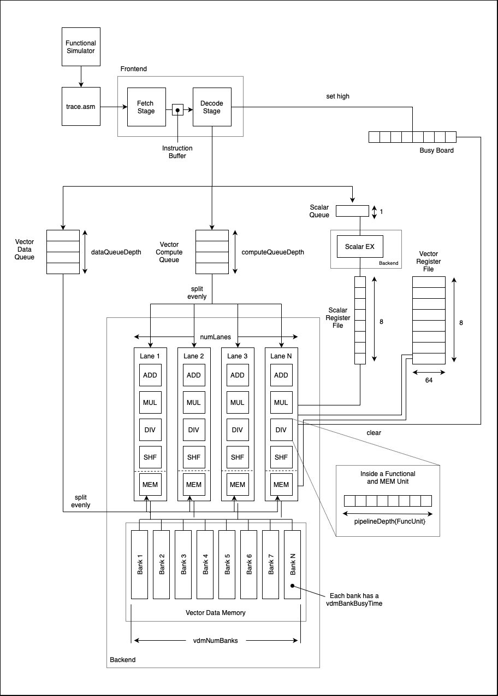

# Vector Processor Project
Gaurav Kuwar, Ritvik Nair

### Timing Simulator Usage:

```
python3 gk2657_rn2520_timingsimulator.py --iodir {iodir}
```

## Block Diagram


## Functional Simulator

Python file: ```gk2657_rn2520_funcsimulator.py```

#### Usage: 
```
python3 gk2657_rn2520_funcsimulator.py --iodir {iodir}
```

The functional simulator takes a VMIPS assembly code as input and simulates output changes in register and memory values over the iteration of each instruction. Key We ran assembly code for dot product, convolution, and fully connected layer with the functional simulator.

## Timing Simulator

Python file: ```gk2657_rn2520_timingsimulator.py```

The timing simulator takes the trace of the VMIPS assembly code and outputs the number of cycles it would take the vector processor to execute all the instructions given some configuration parameters.

## Timing Simulator Optimized
WIP - attempting to add chaining

## Graphs generation
Used the `tests_graphs.ipynb` notebook to generate graphs.